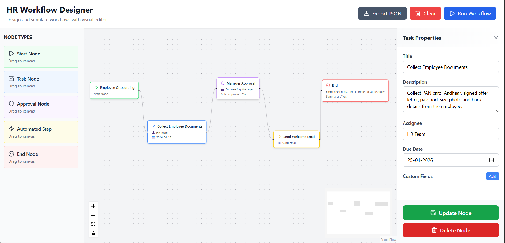
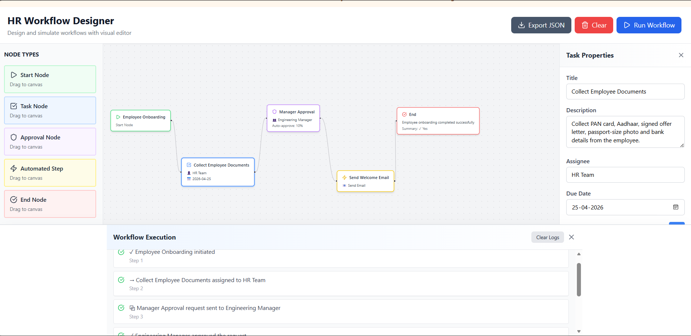

# HR Workflow Designer

A modern, interactive workflow builder for HR processes using React, TypeScript, and React Flow.

## 🌐 Live Demo

https://hr-workflow-designer-react-flow.vercel.app

## 🎯 Features

- **Visual Workflow Editor**: Drag-and-drop interface to design HR workflows
- **5 Node Types**: Start, Task, Approval, Automated Step, and End nodes
- **Smart Properties Panel**: Edit node properties with live validation
- **Workflow Validation**: Automatic validation with error feedback
- **Simulation Mode**: Run and visualize workflow execution with step-by-step logs
- **Export JSON**: Download your workflows as JSON files
- **Delete Nodes**: Remove nodes with automatic edge cleanup
- **Responsive UI**: Clean, modern design with Tailwind CSS
- **Real-time Updates**: See changes instantly on the canvas

## 📸 Screenshots

### Node Edit Panel
Edit node properties with dedicated forms for each node type


### Simulation Panel
View detailed execution logs with step-by-step workflow progression



### Creating a Workflow

1. **Drag Nodes from Sidebar**: Select a node type from the left sidebar and drag it onto the canvas
2. **Edit Properties**: Click any node to open the properties panel on the right
3. **Update Node**: After editing, click the green "Update Node" button to save changes
4. **Connect Nodes**: Draw edges between nodes to define the workflow flow
5. **Validate**: The app automatically validates your workflow (must have Start and End nodes)
6. **Run Simulation**: Click "Run Workflow" to execute and view step-by-step logs
7. **Export**: Click "Export JSON" to download your workflow

### Workflow Controls

| Button | Function |
|--------|----------|
| **Update Node** (Green) | Save property changes for selected node |
| **Delete Node** (Red) | Remove node and all connected edges |
| **Export JSON** (Slate) | Download workflow as JSON file |
| **Clear** (Red) | Clear entire workflow with confirmation |
| **Run Workflow** (Blue) | Execute workflow and view simulation logs |

### Example Workflow

```
Start → Task (Collect Documents) 
  → Approval (Manager Review) 
  → Automated (Send Email) 
  → End
```

## 🔵 Node Types

### Start Node
- **Purpose**: Marks the beginning of a workflow
- **Requirement**: Exactly one per workflow
- **Constraint**: Cannot have incoming edges
- **Properties**:
  - Title
  - Metadata (key/value pairs)
- **Display**: Shows title with ▶ indicator

### Task Node
- **Purpose**: Represents a work task or manual step
- **Display**: Shows title with assignee and due date
- **Properties**:
  - Title
  - Description
  - Assignee (👤)
  - Due Date (📅)
  - Custom Fields (dynamic key/value array)

### Approval Node
- **Purpose**: Represents an approval/review step
- **Display**: Shows title with approver role and threshold
- **Properties**:
  - Title
  - Approver Role (👥)
  - Auto-Approve Threshold (%)

### Automated Step Node
- **Purpose**: Triggers automated actions
- **Display**: Shows automation label (📧 📄 🔔) instead of ID
- **Properties**:
  - Title
  - Automation Action (Send Email, Generate Document, Notify Manager)
  - Dynamic Parameters based on selected action

### End Node
- **Purpose**: Marks the end of a workflow
- **Requirement**: Exactly one per workflow
- **Constraint**: Cannot have outgoing edges
- **Display**: Shows end message with summary indicator (✓/✗)
- **Properties**:
  - End Message
  - Include Summary (boolean)

## ✅ Validation Rules

The app automatically validates workflows before execution:

- ✅ Exactly one Start Node required
- ✅ Start Node has no incoming edges
- ✅ Exactly one End Node required
- ✅ End Node has no outgoing edges
- ⚠️ All nodes must be connected (no orphaned nodes)

## 🏗️ Project Structure

```
src/
├── api/
│   └── mockApi.ts                # Mock API for automations and simulation
├── components/
│   ├── Canvas/
│   │   └── WorkflowCanvas.tsx     # React Flow canvas with drag-drop
│   ├── NodeForms/
│   │   └── NodeFormPanel.tsx      # Properties editor (right sidebar)
│   ├── Nodes/
│   │   ├── StartNode.tsx
│   │   ├── TaskNode.tsx
│   │   ├── ApprovalNode.tsx
│   │   ├── AutomatedNode.tsx
│   │   └── EndNode.tsx
│   ├── Sandbox/
│   │   └── SimulationPanel.tsx    # Execution logs display
│   └── Sidebar/
│       └── NodeSidebar.tsx        # Draggable node palette
├── hooks/
│   ├── useNodeSelection.ts        # Node selection state management
│   ├── useSimulation.ts           # Workflow execution engine
│   └── useWorkflowValidation.ts   # Validation logic
├── types/
│   └── workflow.ts                # TypeScript interfaces
├── App.tsx                         # Main application component
└── index.css                       # Tailwind CSS directives
```

## 🛠️ Technology Stack

- **React 18** - UI framework with Hooks
- **TypeScript** - Type-safe development
- **Vite 8** - Fast build tool
- **React Flow** - Graph/node editor library
- **Tailwind CSS 3** - Utility-first styling
- **Lucide React** - Beautiful icon library
- **PostCSS & Autoprefixer** - CSS processing


## 📄 License

This project is part of an HR workflow case study.
- **Simulation**: Execution logs display


## Technologies

- **React 18**: UI framework
- **TypeScript**: Type-safe development
- **Vite**: Fast build tool
- **React Flow**: Graph visualization
- **Tailwind CSS**: Styling
- **Lucide React**: Icon library

 
